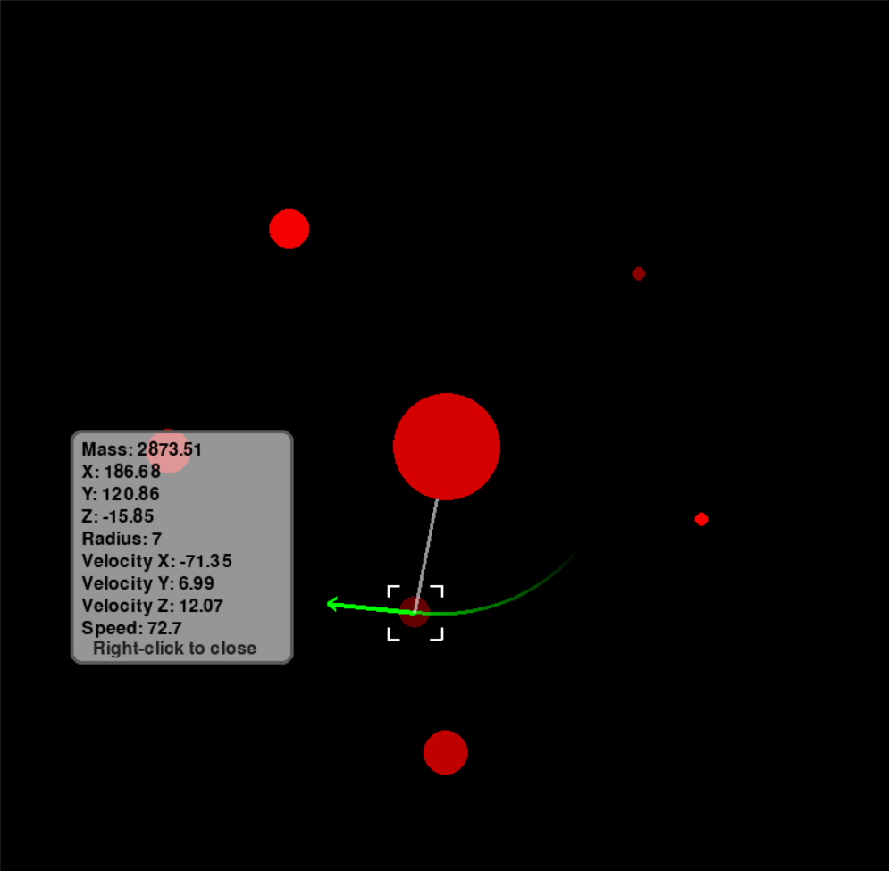

# artificial-universe
A computational ecosystem exploring the emergence of adaptive behavior.



## Overview

Beginning from scratch, this N-body physics simulation creates gravity, motion, and collision detection based upon fundamental principles instead of using a pre-existing physics library. The program models a small number of masses orbiting around a central body in three-dimensional space; a real time visualizer allows the user to see how the system evolves over time.

The question driving this project is whether a structured system like orbits will emerge from a few, basic physical principles without having the structure defined in the program. This is not about programming a simulated solar system but rather providing the program with an appropriate environment for gravity (force), mass and motion so that it may produce structures autonomously.

## How to Run

**Dependencies** — Only library you need to install is pygame. This can be done with writing down this install command in terminal:
```
pip install pygame
```

**How to run** — In terminal write this command:
```
python main.py
```

**Controls:**
- **Left-click a body** to select it. This opens a panel showing that body's stats, highlights it with targeting brackets, shows its direction with an arrow, and draws a line to whatever it orbits.
- **Left-click the same body again** to deselect it.
- **Right-click anywhere** on the screen to close the panel.
- **Drag while holding left-click** on empty space to rotate the camera. Drag while your mouse is on the panel to move it.

## Physics Engine

Currently, this project has been verified as having included a verified 3-D physics engine which represents physics in three ways:

- Gravity
- Motion
- Collision Detection and Response

This engine was created using first principles of physics.

The semi-implicit method used for integration was tested against a previously identified failure mode (energy drift caused by explicit Euler's method), and it passed. Therefore, the total energy of the objects within the simulation remains bounded rather than increasing without bound.

Close encounters have also been addressed by applying a softening term to prevent singularities at close encounter points.

## Orbit Assignment

Each body will automatically be placed into orbit about another body by identifying its "parent". Its "parent" is defined as the body which causes it to be accelerated or decelerated the greatest amount, not necessarily the largest mass.

Once its "parent" has been determined, the child will inherit all aspects of its parent's motion. Thus, a moon may orbit around a planet whose orbit is being influenced by the central body.

## Visualization

This system is user interactable via an exploratory 3-dimensional view:

- Camera rotation
- Depth sorted rendering
- Distance based shading
- A separate panel to display physical data of each object, including their orbital target and velocity vector

---

# Results

## 8/20/2026 — [2:46 AM UTC+4]

It is my first real observation since I started the project, as the project just begin to form. Right now, the observation is made around four bodies.

I should start by writing down their characteristics, i suppose. Starting with orbital_velocity, ball's and ball_2's orbital velocities are relative to each other. However, newly added other two's (body_3 and body_4) orbital velocities are only relative to ball_2, because formula used in orbital_velocity has no way to account for third body (it is derived for exactly two bodies). they all have various masses; therefore, different radiuses and densities. to make up your mind, i will give the order by which their masses decrease: the one with biggest mass is ball_2. following, ball, ball_3, respectively. ball_4 have the least mass.

The first observation was made while ball had located close to both ball_3 and ball_4 (can be observed in lasted commit Fix softening, restitution symmetry, and add 4th body). As a result, ball_3 and ball_4 ended up colliding with ball, which was something unexpected as they were suppose to orbit ball_2. It wasn't a complex problem to reason ,though. my first judgment was "ball's gravity isn't a part of velocity computation (as I mentioned before), and since ball's starting location is closer to smaller bodies than that of ball_2, its unmodeled pull dominates. proximity beats ball_2's larger mass, owing to gravity falling off with distance squared"

estimation wasn't enough, so I made my second observation with ball far apart from other two. This time, ball_3 and ball_4 didn't collide with ball as expected, but instead of setting orbit around ball_2, they became gravitationally bound to each other (since they started only 20 units apart, much closer to each other than to ball_2), collided, and the pair drifted away from ball_2's system together as a bound unit — a small-scale ejection.

**Significance of this discovery:**

Neither binary nor ejection was intentional. There is no coding saying "create binary and eject it". Everything was caused simply by combination of using formula suitable exclusively for calculation of orbital velocity of EXACTLY two bodies (orbital_velocity()), but applied to actual case containing FOUR bodies at once. That pattern repeated itself twice: initially, ball's ignored gravitational attraction won over ball_2's greater mass due to initial proximity between ball, ball_3, and ball_4; and again after displacement, ball_3 and ball_4 formed a binary system among themselves due to initial nearness (started from 20 units of separation), and got ejected together from ball_2's system.

This phenomenon relates directly to known physics problem: there exists no analytical solution for n>2-body problem in contrast to two-body one (connection to Poincaré's theorem on non-integrability of system); furthermore, phenomena such as gravitational ejection of binaries are well recorded in nature, when stars get ejected from stellar cluster. So basically the process I described represents miniature analogy of real-world gravitational process emerging entirely due to application of fundamental physical formulas without any external manipulation or scripting.

**Just wanted to point out:**

That particular result came from single trial of simulation with particular initial values I manually picked. I didn't test for consistency: for example, does small change of initial coordinates yield similar outcome? How dependent on precise initial separation distance this phenomenon is? Is it reproducible and meaningful pattern, or mere coincidence? This poses limitations rather than flaw of discovery itself.

---

# Design notes

## 8/21/2026 — [4:14 AM UTC+4]

Hello there. I decided that I should write about why and how the code and engine are changed overtime when I face a problem. I am writing it while having a break from coding part, and as the part I am working on right now isn't ready, I haven't committed it. For situational awareness, I will be giving some information about the thing, I am working on right now: 2.5D environment is the main focus of the project right now. the physics engine itself is genuinely 3D (real gravity, real motion, real collisions in three dimensions). "2.5D" refers specifically to the rendering approach still to come, where 3D positions will be projected onto a flat 2D screen rather than rendered with a true 3D camera.

The hardest part until now was adapting orbital_velocity() method; therefore, i will be talking about it after now. Previously, orbital_velocity() was finding a perpendicular direction with a pragmatic solution: swap the two components of the center-to-body vector and flip the sign of one. visually (-distance_y, distance_x). It is obvious that switching to 3D simulation broke this, since "perpendicular to a vector" isn't a single direction in 3D. It's basically a whole plane of possible directions, because there are infinitely many vectors that can be perpendicular to a given vector in 3D.

*(Leaving this as a work in progress for tonight. I need to get some sleep and will finish it up tomorrow.)*

## 8/25/2026 — [2:00 AM UTC+4]

After a long break, I am back. it is the contination of my first design note:

With all this information considered, only two options came to my mind: giving each body's orbital plane a small random tilt, or using a fixed reference axis for every body. First option would give more visual variety, I admit, but the tilt itself would be arbitrary, not caused by anything the simulation actually did, just injected in from outside. And that goes against the same principle I've been following since the observations entry (same reasoning as with the binary/ejection case): there is no coding saying "tilt this randomly", so i shouldn't add one. Therefore, second option: one shared, fixed reference axis for every body. Gives a flat orbital disk instead of tilted ones, but nothing arbitrary gets added on top of what the physics already gives.

Mechanism itself is a cross product. By crossing the body's position vector (relative to the barycenter) with the fixed reference axis, (0,0,1), you get a new vector that is guaranteed perpendicular to both of the originals, which puts it exactly where it needs to be, somewhere in the plane perpendicular to "up".

I worked through the general cross product formula by hand, substituted this specific reference axis in, and simplified it down. Small thing fell out of it that i wasn't expecting but was happy about: resulting z-component of the new vector came out to exactly zero. This works as a nice built-in check, because it means, if a body is already lying in the shared flat plane, the formula correctly gives it a direction that also stays in that plane, consistent with the flat-disk design, and not just something that happened to look right by luck. Let me also write it down:

**General 3D cross product** of `a = (a1,a2,a3)` and `b = (b1,b2,b3)` is:

```
a × b = (a2*b3 − a3*b2,  a3*b1 − a1*b3,  a1*b2 − a2*b1)
```

If we consider `a = (distance_x, distance_y, distance_z)` and fixed axis as `b = (0,0,1)`, every component will be like this:

| Component | Calculation | Result |
|---|---|---|
| x | distance_y × 1 − distance_z × 0 | distance_y |
| y | distance_z × 0 − distance_x × 1 | −distance_x |
| z | distance_x × 0 − distance_y × 0 | 0 |

So the raw direction vector is `(distance_y, -distance_x, 0)`. Of course, it still needs to be divided by its own length before it is a usable unit direction.

